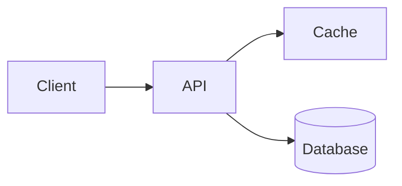

Write documentation that carries the most understanding per word and stays true as the code changes.

## Core principle

Documentation competes with the code itself for the reader's attention and with reality for its own accuracy. Good docs win both: they say only what the code can't say for itself, and they say it in a form that survives edits. Every sentence you add is a sentence someone must later read, trust, and maintain — so it must earn its place.

## Rules

### 1. Shorter is better at equal information

For the same information content, the shorter doc is more valuable. Cut filler, hedging, and restatement. Prefer one precise sentence over a vague paragraph. Never pad to look thorough.

### 2. Don't write anything that drifts as soon as the code changes

Omit facts that go stale on the next edit and won't be updated in lockstep:

- File paths and file/line numbers
- Exact function/variable names quoted in prose that merely narrate the code
- Line counts, "there are 3 cases below", and similar countable claims

Refer to concepts and behavior, which change far more slowly than their exact spelling and location.

### 3. Don't state what the source already makes obvious

Skip anything a competent reader gets from the code in seconds. Instead, spend words on what the code *can't* tell them:

| Write this | Not this |
| --- | --- |
| Why a non-obvious or hard-to-read implementation works the way it does | A restatement of what each line does |
| Architecture and control/data flow that spans many files | What a single self-explanatory function returns |
| The business/historical reason a constraint or workaround exists | `// increment i by one` |
| Non-obvious invariants, gotchas, and ordering requirements | Names already visible in the signature |

### 4. Never guess

Document only what you actually know. Do not speculate about intent, performance, or behavior you haven't confirmed. If something is uncertain, either verify it or leave it out — a confident wrong doc is worse than none. Mark genuine open questions explicitly (e.g. `TODO:`/`NOTE:`) rather than presenting a guess as fact.

### 5. Use lists and tables

Reach for bullet lists and tables whenever they read more clearly than prose — enumerations, option/parameter references, comparisons, and mappings. They scan faster and expose gaps.

### 6. In GitHub Markdown, add Mermaid diagrams when they help

GitHub renders Mermaid, so use a diagram when structure or flow is easier to see than to read. Keep each diagram small and focused on one relationship.

- Architecture / dependencies → `graph`
- Sequence of interactions over time → `sequenceDiagram`
- State machines / lifecycles → `stateDiagram-v2`

````markdown

````

## Before you finish

Re-read the draft and delete every sentence that fails a rule above. If removing it loses no understanding, it was noise.
